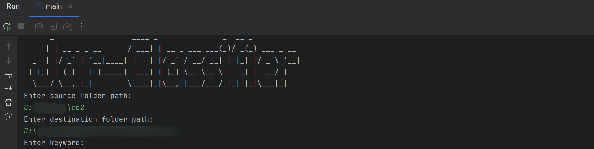

## Intro

In the code audit, often encounter lib contains project internal Jar package situation, how to quickly and accurately distinguish between internal Jar and third-party common Jar?

In addition to commercial SCA software, you may be able to try my humble little tool!

在代码审计中，经常会遇到lib中包含项目内部Jar包的情况，如何快速准确的区分开内部Jar与第三方通用Jar？

除了商业SCA软件，你或许可以试试我这个简陋的小工具

## Usage

You need：

- a folder with the Jar packages to be classified,
- a folder for the results of the classification
- and the package keyword for the internal Jar as you can see it with your naked eye.

Then run:

`java -jar Jar-Classifier.jar`

你需要：

- 一个存放了待分类Jar包的文件夹
- 一个用于存放分类结果的文件夹
- 以及你肉眼观察出的内部Jar的package关键字

然后运行：

`java -jar Jar-Classifier.jar`

## Image

## 更新计划

- 实现另一种分类思路，维护一份通用Jar关键字名单，筛选出第三方Jar
- 支持多个关键字识别
- 提供纯命令行参数运行模式
